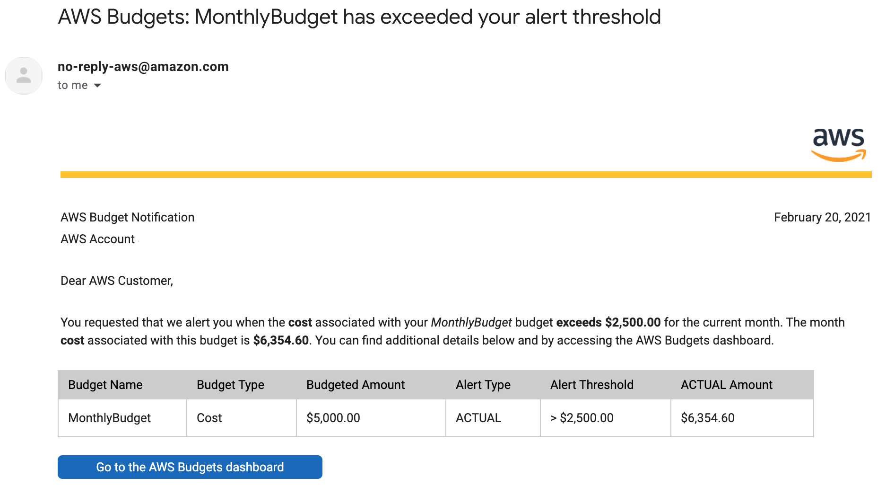

## AWS Budget

**Monthly cost budget**

  - Introduction
      - AWS Budgets provides a feature to handle cost and utilization by providing notifications when cost or usage is beyond the configured threshold. It can only be used as a mechanism to notify the usage and not a medium to restrict the actions.
      - Budgets and notifications are directly dependent on your billing data and it is updated at least once a day 
      **NOTE:** You may not receive an alarm for a forecasted budget if your account is new. Forecasting requires existing usage within the account.
      
  - Create a monthly cost budget
    
    In this tutorial, we will create a monthly forecast budget and configure notification
    
    1. Log in to the console and search for Billing
    

    2. Select Budgets
    

    3. CLick Create a budget
    

    4. Click Set your budget
    

    5. Set your budget and enter the following details:
        - Name: MonthlyBudget
        - Period: Monthly
        - Budget effective dates: Recurring Budget
        - Start Month: (select current month)
        - Budget amount: Fixed
        - Budgeted amount: $5000
        - Other fields: leave as defaults 
    

     6. Scroll below and click Configure alerts
    

     7. Select:
        - Send alert based on: Forecasted Costs
        - Alert threshold: 100% of budgeted amount
        - Email contacts: (your email address)
        - Click on Confirm budget
    

     8. Verify the details, and click Create
    

     9. You will be presented with the current forecast 
    

     10. After the configured threshold is surpassed, you will receive an email similar to this within a few minutes
    
 
 **AWS Budget Report**

 - Introduction
      - AWS Budgets Reports allow you to create and send daily, weekly, or monthly reports to monitor the performance of your AWS Budgets..
      
  - Create a weekly budget report
    
    In this tutorial, we will create weekly budget status and configure notification
    
     1. Under Budgets dashboard, Select on Budgets Reports

     2. Click Create a budget report
     

     3. Select a report with the below details
        - Report name: WeeklyBudgets
        - Select all budgets
     

     4. Select Configure delivery settings

     5. Configure the delivery settings
        - Report frequency: Weekly
        - Day of week: Monday
        - Email recipients
    
     6. Click Confirm budget report
    

     7. Confirm the configuration, click Create
    

     8. Now the budget report setup is complete  
    

     9. You should receive an email similar to the one below   
    
